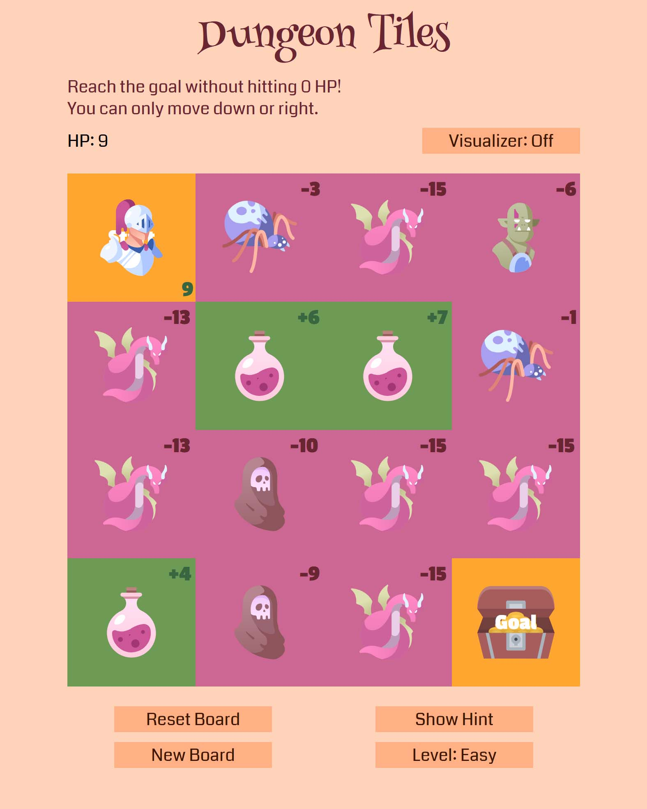
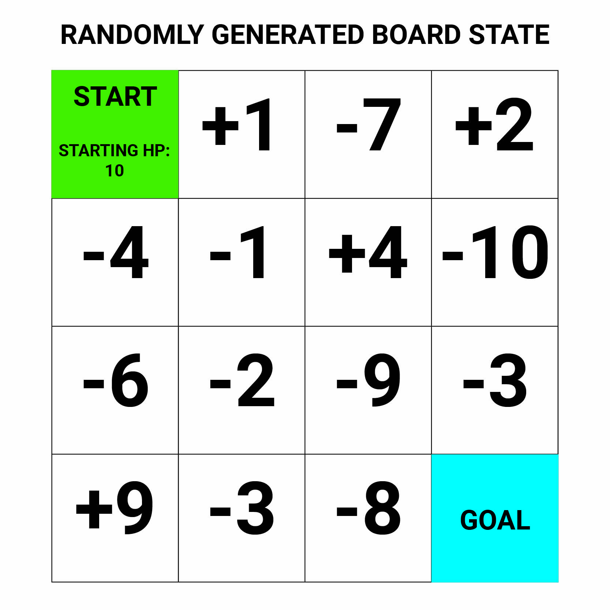
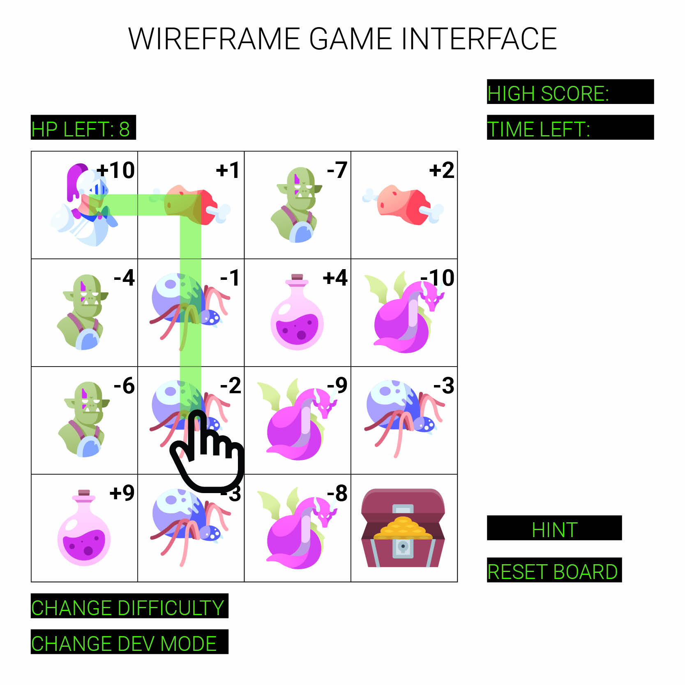

# Dungeon Tiles

**Dungeon Tiles** is a game inspired from Leetcode [Problem #174](https://leetcode.com/problems/dungeon-game/). You are a knight entering a dungeon trying to reach the treasure. Along the way, you will encounter either enemies that you have to fight, losing health in the process, or you will discover health and restoration items to heal your wounds. Can you reach the treasure while staying alive?

## Rules and features

**Rules**
 - The player begins on the top left square of the game grid, and can only move down or to the right.
 - Each tile will either add or subtract from the player's current HP based on the value of the tile.
 - The player must reach the end tile in the bottom right square without their HP ever becoming 0.

**Features**
 - There are three difficulties with bigger grids, harder enemies, and fewer health items!
 - There is a button to briefly show random tiles in the solution path as hints.
 - Visualization mode will show the algorithm behind the random game generation and traceback the solution path.

## Technologies and sources used

**Languages used**
 - HTML
 - CSS
 - Javascript / Typescript

**Sources used**
  - Simple CSS animations: [shaking animation](https://codepen.io/jh3y/pen/yLKMOBm) for invalid moves, and an [idle floating animation](https://codepen.io/MarioDesigns/pen/woJgeo) for the next valid tiles.
  - A [converter](https://codepen.io/sosuke/pen/Pjoqqp) for recreating color swatches from CSS filters for SVGs imported using `img` tags in HTML.
  - CSS Reset style sheet based on [this template](https://piccalil.li/blog/a-modern-css-reset/)  
  - SVGS were all downloaded from [SVG Repo](https://www.svgrepo.com)
  - Brief explanation of [async-await](https://stackoverflow.com/questions/3583724/how-do-i-add-a-delay-in-a-javascript-loop) for timing for loops.
 

## Installation recommendations

 1. Feel free to fork and clone the repository.
 2. The [Better Comments](https://marketplace.visualstudio.com/items?itemName=aaron-bond.better-comments) extension for VSCode is recommended as the created documentation uses this extension.
 3. The main branch only includes the vanilla Javascript, but the project was written in Typescript and can be found in the **devTS** branch for cleaner formatting and better type documentation.
 4. The **devTS** branch also includes a config file for the [Five Server](https://marketplace.visualstudio.com/items?itemName=yandeu.five-server) extension in VSCode.

## User Stories

**As a user...**  
- I want to be able to simulate a path on the board and see my calculated HP left so that I can better plan out my route.  
- I want to be able to receive hints from the computer that reveal certain squares that the best path will traverse in order to have a starting point to plan my route.  
- I want to be able to change the difficulty so I can challenge myself if I want to.  
- I want to have icons on the board that represent enemies or health potions so that I can better visualize the board state.  

**As a developer...**  
- I want to have a visualization mode where I can configure the board state and see the computer's calculated best path.  
- I want to be able to visualize the algorithm it is using to calculate the minimum HP needed to reach the goal.  
- I want to be able to visualize the algorithm it is using to find the best path.

## Wireframes

## Challenges

**Algorithms**
 - Computing minimum HP needed to guarantee at least one viable solution. This is the answer to the original [Leetcode problem](https://leetcode.com/problems/dungeon-game/), and uses a dynamic programming traceback approach to calculate the result in `O(n x m)` time complexity.
 - Computing the viable solution path within the same algorithm. As shown in the visualization mode, the original algorithm simply needs to store the optimal next tile to move to for every single tile taking a linked-list like approach. The final solution can be computed by following the traceback algorithm from the start. This algorithm is will still be in `O(n x m)` time complexity.

**CSS**
 - CSS Grid was needed to create an easily re-scalable and responsive game grid that maintains a 1:1 aspect ratio.
 - By using Flexbox and `clamp()`, the page is fully responsive and the only media query that is used is to change the font-weight (though I would have liked to have no media queries at all).

**Javascript**
 - Async-await is used to generate a delay to simulate the search algorithm in visualization mode. A major hurdle involved was making sure the visualization would not continue displaying arrows if visualization mode is toggled off mid-way through, and that the visualization function would not continue occupying the call stack if the board was reset or a new board was generated.
 - Functions could have been better organized so the global scope did not have that many variables. The callback functions, especially, rely on modifying the global scope through side-effects.
 - An OOP approach was used storing information such as the `Tile` class, `Sprite` class, and `Difficulty` class. 
